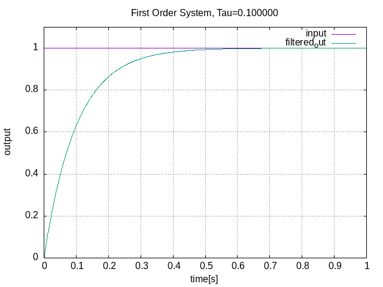

# First Order System
C++ implementation of first order system

## Example
### Dependency
- yaml-cpp: `sudo apt install libyaml-cpp-dev`
- gnuplot: `sudo apt-get install gnuplot`

### Build and Run
1. update constraints in `examples/constraints.yaml`
2. build and run
    ```
    cd example && ./build_and_run.sh
    ```
    output `data_txt` and `graph.png` are saved under `examples` dir.

### Example result
